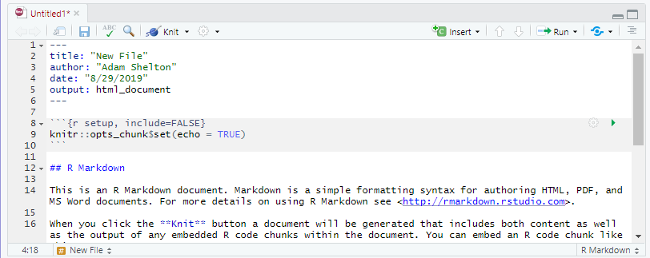
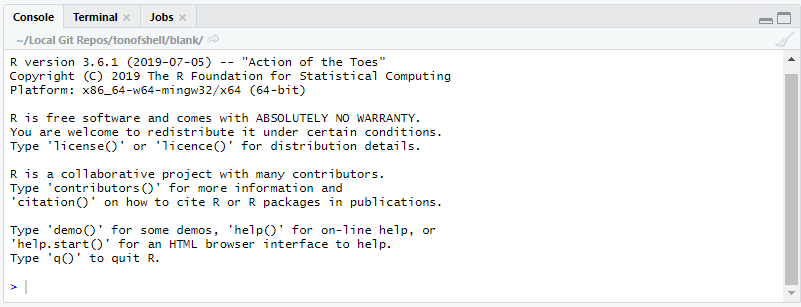
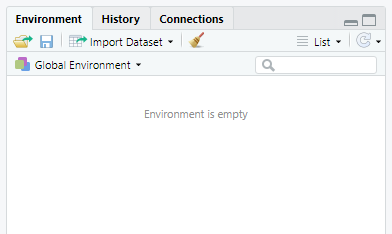

```{r setup, include=FALSE}
library(tidyverse)
library(knitr)
library(magrittr)
knitr::opts_chunk$set(echo = TRUE)
```

# Introduction

## What is R?

- According to [official R Project website](https://www.r-project.org/), *"R is a free software environment for statistical computing and graphics."*
- While the typical R environment is typically called just "R", it is actually made of several components from different sources
  - __R Language and Interpreter__ 
    - These define the rules and syntax for the language, and converts R code into code your computer can understand
    - Distributed by the R Project on The Comprehensive R Archive Network (CRAN) repository
  - __R Packages__ 
    - These include first and third party software additions to add functionality to the language 
    - Distributed in the base installation of R, on the CRAN repository, on Git Hub, and by other means
  - __R Integrated Development Environment (IDE)__
    - This allows you to interact with the language and more easily produce, test, and understand code
    - The R base installation includes a very rudimentary IDE (this is almost never used)
      - R Studio is a third party open source IDE that is widely considered the best (and default) IDE for R
      
## What is so great about R?
```{r pros-cons-table, echo=FALSE, message=FALSE, warning=FALSE}
tibble(Pros = c("Open Source", "Highly reproducible", "Free to use", "Rich package ecosystem"), Cons = c("Provides a specific tool-set", "Not always intuitive", "Variance in quality", "Performance can be slower")) %>% kable()
```

## Who is R for? (and where do I get it?)

- R is primarily for researchers in the data science realm
  - However, R includes tools for working with a wide range of data, even more qualitative methods
  - The `ggplot2` package in R is often referred to as the "gold standard" for data visualization
- Due in part to their open source nature, R and R Studio are available for macOS, Windows, Linux and web(!?)
  - On a personal computer you can install the appropriate r-base files from [the CRAN](https://cran.r-project.org/) and R Studio from [the R Studio website](https://www.rstudio.com/products/rstudio/download/#download)
  - You can also use R and R Studio from any web browser using [R Studio Cloud](https://rstudio.cloud)
    - This does mean any data used for analysis is stored in the cloud __*NOT*__ on your computer
    - R Studio Cloud is built off of [R Studio Server](https://www.rstudio.com/products/rstudio/download-server/) which anyone (with the right motivation and technical skills) can use to run their own browser-accessible R Studio experience
    
## Additional Resources
- This presentation is geared to providing a sturdy base to get you working in R and R Studio
- However, the world of R is immense, with many more topics and packages than we could ever hope to cover
- Many references will be made to [R for Data Science](https://r4ds.had.co.nz/) by Garrett Grolemund and Hadley Wickham
  - Links to relevant sections will be provided whenever possible, but feel free to read the entire eBook at your leisure (it's free)!
- Modeling in R will only be touched on very briefly and broadly, as the modeling process is highly dependent on the package used
  - The help documentation will be your best friend, which goes for other packages and topics as well
- You can page through the content of this presentation in the form of a regular webpage [here](presentation.md)


# Getting Started

## R Studio's User Interface
- R Studio is split into four main panes
- The tabs in each pane depend on the current context, with additional tabs appearing when other features have been activated


## Upper Left Pane - Source


- Shows the source code for your open files
- Each open file gets a tab
- Tabs get different buttons as applicable (like the `Run` button for R files)

## Lower Left Pane - Command Line


- The `Console` tab shows the R console allowing you to issue and view the output of R commands
- The `Terminal` tab gives access to the system terminal
- Other tabs appear depending on the context of what you are doing and generally show the statuses of other relevant systems (e.g knitting of an R Markdown document)

## Upper Right Pane - Environment et. al. 


- The `Environment` tab shows all the variables in your current environment and allows you to view them
- The `History` tab shows all the commands you have run this session
- The `Connections` tab allows you to connect to a database

## Lower Right Pane - Everything Else


- The `File` tab shows files in the current directory and allow for moving, copying, deleting, and renaming files
- The `Packages` tab allows for the installation, loading, and unloading of packages
- The `Help` tab provides searchable access to the help files for all installed packages
- The `Plots` and `Viewer` tabs display certain objects and files, they are automatically selected when an object to be plotted or viewed is generated

## Your First R Script
- __Make a new project__
  - Go to `File` > `New Project...` > `New Directory` > `New Project`
  - Give your first project a name, like *"First Project"*
  - Select the folder you want to save this project in
  - Keep all other options unchecked
  - Click `Create Project`
- __Create a new R script__
  - Go to `File` > `New File` > `R Script`
  - In the source editor for the script type `"Hello world"`
  - Save the script under a meaningful name like `hello_world`
  - In the upper right corner of the source tab, click `Run` > `Run All`
  - "Hello world" should print out in the `Console` tab below
- __The Result__
```{r hello-world, echo=FALSE}
"Hello world"
```

## More Things to Try
- Enter each of these into a line in your script and run it or type each into the console and hit enter to run each command individually
```{r samples-1}
# Arithmetic
(2 + 2) * 4^2

# Create a variable for your favorite number
fav_num = 7

# ...or your favorite color
fav_color = "blue"
fav_color

# Save a vector (a group) of numbers
evens = c(2, 4, 6, 8, 10)

# Use a function
mean(evens)

# Use variables
fav_num + evens
```

## What did we learn?
- Whether you run a command from a script or the console the result is the same
  - A script is just a way to save a sequence of commands to be reproduced later
- Arithmetic works mostly the way you would expect it to
  - Any expression that returns a result is displayed in the console
- Variables allow you to preserve a value to use later in the session
  - Setting a variable does not return a result, although we can see the value of our variable in the `Environment` tab or by entering the name of the variable as a command
- Vectors can be created using the `c()` function and hold any number of the same type of object (e.g all numbers or all text)
- Functions can be applied over vectors
  - However, how they are applied will vary (e.g. mean vs. +)


# Data Structures

## Vector Basics
- Vectors are a collection of the same type of object (e.g. `c(1, 2, 3)` or `c("a", "b", "c")` )
- Scalars are a single object (e.g. `1` or `"a"`)
  - However in R scalars are just vectors of length one, so `1` is the same as `c(1)`
- Vectors have two properties
  - A length
  - A type
- While vectors can have any length, there are six basic types called Atomic Vectors
  - Numeric (e.g. `1` or `5.37`)
    - There are two types of numeric vectors
      - Integer (e.g. `1`)
      - Double  (e.g. `5.37`)
  - Character (e.g. `"hello"` or `'hello'`)
  - Logical (e.g. `TRUE` or `FALSE`)

## Working with Atomic Vectors
- Vectors can be converted or coereced to a different compatible type
```{r working-vectors}
as.logical(c(1, 0, 0, 1))
as.logical(c("TRUE", "FALSE", "F", "T"))

as.numeric(c(TRUE, FALSE, F, T))
as.numeric(c("1", "0", "0", "1"))

as.character(c(TRUE, FALSE, F, T))
as.character(c(1, 0, 0, 1))
```

## Sequences
- A sequence is a special way of generating a numeric vector
- Each item in the vector increases or decreases a constant amount from the previous item
- Sequences can be defined in two ways
  - The `seq()` function
    - The `by` argument specifies the amount to increment, by default it is 1
  - The `:` operator
```{r sequences}
1:5
seq(1, 5)
seq(1, 10, by = 3)
```


## Making Logical Vectors
- Logical vectors can also be made using different comparison operators including `==`, `<`, `>`, `<=`, `>=`, `%in%`
```{r making-logical-vectors}
1:5 <= 3
1:5 == 4
c("hello", "there", "friend") == "there"
"hello" %in% c("hello", "there", "friend")
```


## Finding the Type of a Vector
- You can test the type of a vector using the `typeof()` function
```{r test-vector-type}
typeof("hello")
typeof(6)
typeof(TRUE)
```

## Vector-ception
- Other objects are made up vectors
  - Lists 
    - A list can contain an unlimited number of vectors or other lists (multi-dimensional)
  - Dataframe / Tibble / Matrix
    - A list of vectors, where each vector is the same length and represents a column of values (two-dimensional)
    - Dataframes or Tibbles can have different types for each column
    - For matrices all columns must be the same type (typically numeric)
- To learn more about vectors and vector-based objects in [R for Data Science: Chapter 20](https://r4ds.had.co.nz/vectors.html)

## Tibbles
- Data is usually distributed / imported in the form of a dataframe or tibble
  - A tibble is an updated version of the dataframe included in the `tidyverse` package
    - Tibbles only display the first 10 rows when printed to the console and do not convert column types, unlike dataframes
    - A dataframe can be coerced to a tibble with the `as_tibble()` function 
- Since the tibble is __NOT__ included with the base R packages we must install and load the `tidyverse` package
  - In the `Packages` tab there is an `Install` button, click that and type "tidyverse" and install it
  - Once a package is installed you can load it using the `library()` function, run `library(tidyverse)` from a script or the console to load the `tidyverse` package
  - The `tidyverse` package is actually several data science packages that follow a common "tidy" analysis philosophy and are all installed and loaded together 
    - You can learn more about it on the [tidyverse website](https://www.tidyverse.org/)
    
## Using a Tibble
- Now that the `tidyverse` package is loaded we can begin to use tibbles for storing data
  - Use the `tibble()` function to create a new tibble
  - Specify the name and data for each column as a new named argument (e.g. `tibble(grades = c("A", "B", "A", "D"), age = age_vector`))
    - Notice that you can pass in a variable that refers to a vector that has been previously defined
- Calling the name of a tibble variable prints out the first 10 rows of the tibble
  - View all of the tibble by clicking on its information in the `Environment` tab
- There are a few ways to select rows and / or columns to view / use
  - Get a column with `my_tibble$col_name`, `select(my_tibble, "col_name")`, `my_tibble["col_name"]`, or `my_tibble[col_index]`
    - Selecting an individual column using the latter two methods will return a tibble __NOT__ a vector 
      - For some functions like `mean()`, you may need to use `unlist()` to convert a single-columned tibble to a vector
  - Get a row with `my_tibble[row_index, ]` (notice the comma after `row_index`)
  - Get a value at a location as a tibble with `my_tibble[row_index, col_index]`
- Get the dimensions of a tibble with `nrow(my_tibble)` for the number of rows and `ncol(my_tibble)` for the number of columns

## Trying a Tibble
- The `iris` dataset gives different measurements for 150 different irises of 3 species
- Create a tibble of the iris dataset using `as_tibble(iris)` with the variable name `iris_data`
- Answer the following questions:
  1. What is the mean sepal length?
  1. What is the median petal width?
  1. What is the mean petal area? (Hint: Vectors of same lengths can be multiplied by each other)
  1. Are there an equal number of each species? (Hint: the `table()` function might be useful)

## Trying a Tibble | Answers
```{r trying-tibble}
iris_data = as_tibble(iris)
mean(iris_data$Sepal.Length)
median(iris_data$Petal.Width)
mean((iris_data$Petal.Length * iris_data$Petal.Length))
table(iris_data$Species)
```

## Trying a Tibble | Takeaways
- Oftentimes there are many ways to do the same thing
- There are __*MANY*__ different packages and functions to make your life easier
  - To learn more about a function, package, or included dataset, search for it in the `Help` tab or, if you know the name, use the `?` function (e.g. `?iris`)
- The `iris` dataset contains a special kind of vector for the species variable - called a factor
  - This is essentially a categorical variable
  - Factors have levels (categories) which each have a label assigned to them
  - Can be unordered (as in the case of species) or ordered (as in the case of a Likert scale)
  

# Data Wrangling

## What is Data Wrangling?
- The process of taking the data you have and putting it into the form you need for your analysis
- Includes a wide range of processes and tools
  - Importing / converting
  - Variable creation
  - Merging
  - Reshaping 
  - Cleaning
- This is usually the most time consuming part of any data project

## But First, the Humble Pipe
- Data wrangling can get complex and messy pretty fast
- In Base R, if you need to perform many operations on an object, you have three options
  - Create lots of variables
```
a_1 = function_one(x)
a_2 = function_two(a_2)
a_3 = function_three(a_3)
```
  - Overwrite existing variables
```
a = function_one(x)
a = function_two(a)
a = function_three(a)
```  
  - Create many nested functions
```
a = function_three(function_two(function_one(x)))
```
  - This might be fine for a few operations, but more complex combinations quickly become an unreadable and hard to debug mess
- In research, we want our analyses to be transparent and reproducible, in Base R this is difficult to achieve for complex code 
- For these reasons the pipe operator was created and included in the tidyverse

## Becoming an R Plumber
- The pipe operator (`%>%`) directs a variable or the output of a function into the input arguments of another function

*So our previous example of*
```
a = function_three(function_two(function_one(x)))
```
*...becomes...*
```
a = x %>% function_one() %>% function_two() %>% function_three()
```
- Wa-hoo! Much better! But what about functions with multiple arguments, like the `round()` function (which rounds numbers to a specified amount of decimal places)?

*Simple!*
```{r pi-3-old}
round(pi, 3)
```
*...becomes...*
```{r pi-3-new}
pi %>% round(3)
```
  
## Advanced R Piping
- By default the output is piped into the first argument of the next function
- However, sometimes we might need to pipe data elsewhere
  - The dot (`.`) tells the pipe where else to pipe the data into, in addition to the first argument
```{r dot-pipe}
iris_data %>% select(Sepal.Length) %>% as_vector() %>% tibble(Standardized.Length = (. / mean(.)) ) %>% head(1)
```
  - A dot at the beginning of the chain creates a function you can call later
```{r dot-pipe-2}
std_var = . %>% as_vector() %>% tibble(Standardized.Var = (. / mean(.)) )
iris_data %>% select(Sepal.Length) %>% std_var() %>% head(1)
```
  - Putting curly brackets (`{}`) around a function, causes the data to __*ONLY*__ be piped to the dots
```{r curly-pipe}
iris_data %>% select(Sepal.Length) %>% as_vector() %>% {tibble(Standardized.Length = (. / mean(.)) )} %>% head(1)
```
  - Other pipe operators and functions to pair with pipes exist in the `magrittr` package

## Tidy Data
- Data is easiest to work with when it is tidy, defined by [R for Data Science](https://r4ds.had.co.nz/tidy-data.html#tidy-data-1) when:
  1. Each variable has its own column.
  1. Each observation has its own row.
  1. Each value has its own cell.
- You will commonly need to convert from long to wide tibbles or vice versa to tidy data
  - `spread()` converts from long data to wide data
  - `gather()` converts from wide to long data
  - `unite()` combines multiple columns into a single new column
  - `separate()` splits a column into multiple new columns
- Functions from the `stringr` package can be used to modify character vectors before or after this process
  
## Using `spread()`
```{r spread}
table2 %>% head(4)
table2 %>% spread(key = "type", value = "count") %>% head(4)
```

## Using `gather()`
```{r gather}
table1 %>% head(4)
table1 %>% gather(key = "type", value = "count") %>% head(4)
```

## Using `unite()`
- Specifying the separator is optional but can be specified with the `sep` argument (e.g. `sep = "_")
```{r unite}
table1 %>% head(4)
table1 %>% unite("info", cases, population) %>% head(4)
```
## Using `separate()`
- Specifying the separator is optional but can be specified with the `sep` argument (e.g. `sep = "/")
```{r separate}
table3 %>% head(4)
table3 %>% separate(rate, c("cases", "population")) %>% head(4)
```

## Excluding Variables
- Commonly in R, the dash (`-`) is used to specify "all but this", as with
  - Negative indices: `my_vector[-5]` would return all the items in the vector except the one at index 5
  - Negative variables: `my_tibble %>% select(-age)` would return a tibble with every variable from `my_tibble` except `age`
- Most functions in the tidyverse allow the exclusion of variables from a process by passing their names with a dash in front as the last arguments
```{r exclude}
table1 %>% head(4)
table1 %>% gather(key = "type", value = "count", -country, - year) %>% head(4)
```

## Filtering a Dataset
- Filtering allows to subset data by the specific values of a given variable
- The `filter()` function takes a comparison of a variable and a value and returns each row where that comparison is `TRUE`
```{r filtering}
table1 %>% filter(country == "China")
table1 %>% filter(cases > 3000)
```

## Creating or Modifying Variables
- While there are many ways to create or modify variables, the recommended way is to use the `mutate()` function
- The `mutate()` function takes a name for a variable and any code to generate that variable
```{r mutate}
table1 %>% mutate(rate = cases / population)
table1 %>% mutate(year = year %>% as.character() %>% str_sub(3))
```

## Importing Data
- Most likely the data you need to analyze will not come as a tibble built-in to an R package
- Included in the tidyverse are the `readr`, `haven`, and `readxl` packages for importing different file types directly to tibbles in R
  - `reader` includes functions to read standard delimited file types such as CSV and TSV files
  - `haven` includes functions to read files from other stats programs such as Stata, SPSS, and SAS 
  - `readxl` includes functions to read Excel files 
- Other packages can add support for reading other types of files
  - `sf` provides tools for working with GIS data such as shapefiles
  - `jsonlite` adds functionality for reading and writing to JSONs
  - If it exists, there's probably an R package to open it
    - However, some packages read data as a data frame and will need to be converted to a tibble before proceeding
- The `here()` function in the `here` package makes specifying a file path much easier
  - There is a good example of its benefits and uses [on GitHub](https://github.com/jennybc/here_here)

## Everything Else
- Datasets are rarely complete, and may be explicitly or implicitly missing values
  - Explicitly missing values are defined in R by `NA`
  - Oftentimes missing values will need to be omitted, the `na.omit()` function will remove any rows that have any missing values
  - More about accounting for missing values is covered in [this chapter](https://r4ds.had.co.nz/tidy-data.html#missing-values-3) of R for Data Science
- Joining different datasets is a common problem, but unfortunately it was too time consuming to include here
  - The [chapter on relational data](https://r4ds.had.co.nz/relational-data.html), covers this in detail by using data on flights in and out of NYC airports 
  
## Analyzing Student Data
1. Download the CSV file [student_data.csv](https://github.com/tonofshell/r-crash-course/releases/latest/download/student_data.csv) and copy it to your project directory
1. Install and import the `here` package
1. Import the data using the appropriate function from the `readr` package (learn more about the package on the [tidyverse website](https://readr.tidyverse.org/))
1. Rearrange the data to only have variables for first, middle, and last names, school, year, and math, english, science, and social studies grades
1. Calculate the GPA for each student for each year (Hint: it may be easier to __NOT__ use the `mean()` function)
1. Find the average GPA for each school in 2018 (This can be done all in one step with the `aggregate()` function for bonus points)

## Analyzing Student Data | Answers
```{r analyzing-student-data1, echo=TRUE, message=FALSE, warning=FALSE}
library(here)
student_data = read_csv(here("student_data.csv"))
```

```{r analyzing-student-data2}
gathered_student_data = student_data %>% select(-age, -grade) %>% 
  gather("key", "grade", - first, - middle, -last, -school) %>% 
  separate(key, c("class", "year"), sep = "__") 
gathered_student_data %>% head(4)

final_student_data = gathered_student_data %>% spread("class", "grade") %>% 
  mutate(gpa = (math_grade + english_grade + science_grade + social_studies_grade) / 4)
final_student_data %>% head(4)

# the easy way, repeat for each school
final_student_data %>% filter(year == 2018, school == "Oakwood") %>% select(gpa) %>% unlist() %>% mean()
# the harder way
final_student_data %>% filter(year == 2018) %>% {aggregate(.$gpa, by = list(school = .$school), mean)}
```

