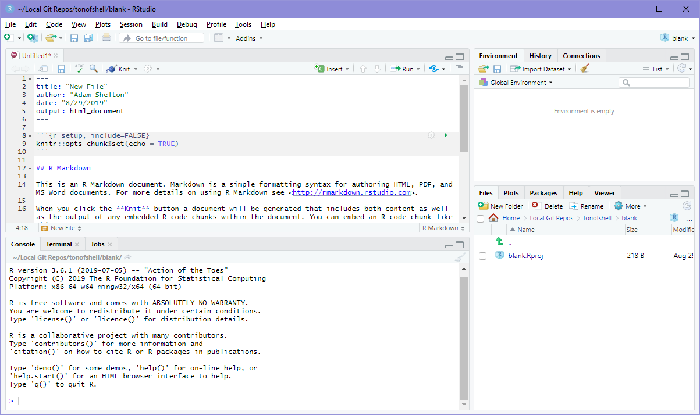
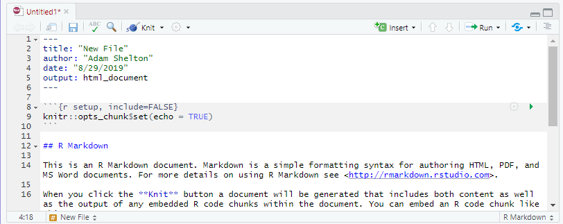

# Introduction

## What is R?

- According to [official R Project website](https://www.r-project.org/), *"R is a free software environment for statistical computing and graphics."*
- While the typical R environment is typically called just "R", it is actually made of several components from different sources
  - __R Language and Interpreter__ 
    - These define the rules and syntax for the language, and converts R code into code your computer can understand
    - Distributed by the R Project on The Comprehensive R Archive Network (CRAN) repository
  - __R Packages__ 
    - These include first and third party software additions to add functionality to the language 
    - Distributed in the base installation of R, on the CRAN repository, on Git Hub, and by other means
  - __R Integrated Development Environment (IDE)__
    - This allows you to interact with the language and more easily produce, test, and understand code
    - The R base installation includes a very rudimentary IDE (this is almost never used)
      - R Studio is a third party open source IDE that is widely considered the best (and default) IDE for R
      
## What is so great about R?

Pros                     Cons                         
-----------------------  -----------------------------
Open Source              Provides a specific tool-set 
Highly reproducible      Not always intuitive         
Free to use              Variance in quality          
Rich package ecosystem   Performance can be slower    

## Who is R for? (and where do I get it?)

- R is primarily for researchers in the data science realm
  - However, R includes tools for working with a wide range of data, even more qualitative methods
  - The `ggplot2` package in R is often referred to as the "gold standard" for data visualization
- Due in part to their open source nature, R and R Studio are available for macOS, Windows, Linux and web(!?)
  - On a personal computer you can install the appropriate r-base files from [the CRAN](https://cran.r-project.org/) and R Studio from [the R Studio website](https://www.rstudio.com/products/rstudio/download/#download)
  - You can also use R and R Studio from any web browser using [R Studio Cloud](https://rstudio.cloud)
    - This does mean any data used for analysis is stored in the cloud __*NOT*__ on your computer
    - R Studio Cloud is built off of [R Studio Server](https://www.rstudio.com/products/rstudio/download-server/) which anyone (with the right motivation and technical skills) can use to run their own browser-accessible R Studio experience
    
## Additional Resources
- This presentation is geared to providing a sturdy base to get you working in R and R Studio
- However, the world of R is immense, with many more topics and packages than we could ever hope to cover
- Many references will be made to [R for Data Science](https://r4ds.had.co.nz/) by Garrett Grolemund and Hadley Wickham
  - Links to relevant sections will be provided whenever possible, but feel free to read the entire eBook at your leisure (it's free)!
- Modeling in R will only be touched on very briefly and broadly, as the modeling process is highly dependent on the package used
  - The help documentation will be your best friend, which goes for other packages and topics as well
- You can page through the content of this presentation in the form of a regular webpage [here](presentation.md)

# Getting Started

## R Studio's User Interface
- R Studio is split into four main panes
- The tabs in each pane depend on the current context, with additional tabs appearing when other features have been activated



## Upper Left Pane - Source


- Shows the source code for your open files
- Each open file gets a tab
- Tabs get different buttons as applicable (like the `Run` button for R files)

## Lower Left Pane - Command Line


- The `Console` tab shows the R console allowing you to issue and view the output of R commands
- The `Terminal` tab gives access to the system terminal
- Other tabs appear depending on the context of what you are doing and generally show the statuses of other relevant systems (e.g knitting of an R Markdown document)

## Upper Right Pane - Environment et. al. 


- The `Environment` tab shows all the variables in your current environment and allows you to view them
- The `History` tab shows all the commands you have run this session
- The `Connections` tab allows you to connect to a database

## Lower Right Pane - Everything Else


- The `File` tab shows files in the current directory and allow for moving, copying, deleting, and renaming files
- The `Packages` tab allows for the installation, loading, and unloading of packages
- The `Help` tab provides searchable access to the help files for all installed packages
- The `Plots` and `Viewer` tabs display certain objects and files, they are automatically selected when an object to be plotted or viewed is generated

## Your First R Script
- __Make a new project__
  - Go to `File` > `New Project...` > `New Directory` > `New Project`
  - Give your first project a name, like *"First Project"*
  - Select the folder you want to save this project in
  - Keep all other options unchecked
  - Click `Create Project`
- __Create a new R script__
  - Go to `File` > `New File` > `R Script`
  - In the source editor for the script type `"Hello world"`
  - Save the script under a meaningful name like `hello_world`
  - In the upper right corner of the source tab, click `Run` > `Run All`
  - "Hello world" should print out in the `Console` tab below
- __The Result__

```
## [1] "Hello world"
```

## More Things to Try
- Enter each of these into a line in your script and run it or type each into the console and hit enter to run each command individually

```r
# Arithmetic
(2 + 2) * 4^2
```

```
## [1] 64
```

```r
# Create a variable for your favorite number
fav_num = 7

# ...or your favorite color
fav_color = "blue"
fav_color
```

```
## [1] "blue"
```

```r
# Save a vector (a group) of numbers
evens = c(2, 4, 6, 8, 10)

# Use a function
mean(evens)
```

```
## [1] 6
```

```r
# Use variables
fav_num + evens
```

```
## [1]  9 11 13 15 17
```

## What did we learn?
- Whether you run a command from a script or the console the result is the same
  - A script is just a way to save a sequence of commands to be reproduced later
- Arithmetic works mostly the way you would expect it to
  - Any expression that returns a result is displayed in the console
- Variables allow you to preserve a value to use later in the session
  - Setting a variable does not return a result, although we can see the value of our variable in the `Environment` tab or by entering the name of the variable as a command
- Vectors can be created using the `c()` function and hold any number of the same type of object (e.g all numbers or all text)
- Functions can be applied over vectors
  - However, how they are applied will vary (e.g. mean vs. +)

# Data Structures

## Vector Basics
- Vectors are a collection of the same type of object (e.g. `c(1, 2, 3)` or `c("a", "b", "c")` )
- Scalars are a single object (e.g. `1` or `"a"`)
  - However in R scalars are just vectors of length one, so `1` is the same as `c(1)`
- Vectors have two properties
  - A length
  - A type
- While vectors can have any length, there are six basic types called Atomic Vectors
  - Numeric (e.g. `1` or `5.37`)
    - There are two types of numeric vectors
      - Integer (e.g. `1`)
      - Double  (e.g. `5.37`)
  - Character (e.g. `"hello"` or `'hello'`)
  - Logical (e.g. `TRUE` or `FALSE`)

## Working with Atomic Vectors
- Vectors can be converted or coereced to a different compatible type

```r
as.logical(c(1, 0, 0, 1))
```

```
## [1]  TRUE FALSE FALSE  TRUE
```

```r
as.logical(c("TRUE", "FALSE", "F", "T"))
```

```
## [1]  TRUE FALSE FALSE  TRUE
```

```r
as.numeric(c(TRUE, FALSE, F, T))
```

```
## [1] 1 0 0 1
```

```r
as.numeric(c("1", "0", "0", "1"))
```

```
## [1] 1 0 0 1
```

```r
as.character(c(TRUE, FALSE, F, T))
```

```
## [1] "TRUE"  "FALSE" "FALSE" "TRUE"
```

```r
as.character(c(1, 0, 0, 1))
```

```
## [1] "1" "0" "0" "1"
```

## Finding the Type of a Vector
- You can test the type of a vector using the `typeof()` function

```r
typeof("hello")
```

```
## [1] "character"
```

```r
typeof(6)
```

```
## [1] "double"
```

```r
typeof(TRUE)
```

```
## [1] "logical"
```

## Vector-ception
- Other objects are made up vectors
  - Lists 
    - A list can contain an unlimited number of vectors or other lists (multi-dimensional)
  - Dataframe / Tibble / Matrix
    - A list of vectors, where each vector is the same length and represents a column of values (two-dimensional)
    - Dataframes or Tibbles can have different types for each column
    - For matrices all columns must be the same type (typically numeric)
- To learn more about vectors and vector-based objects in [R for Data Science: Chapter 20](https://r4ds.had.co.nz/vectors.html)

## Tibbles
- Data is usually distributed / imported in the form of a dataframe or tibble
  - A tibble is an updated version of the dataframe included in the `tidyverse` package
    - Tibbles only display the first 10 rows when printed to the console and do not convert column types, unlike dataframes
    - A dataframe can be coerced to a tibble with the `as_tibble()` function 
- Since the tibble is __NOT__ included with the base R packages we must install and load the `tidyverse` package
  - In the `Packages` tab there is an `Install` button, click that and type "tidyverse" and install it
  - Once a package is installed you can load it using the `library()` function, run `library(tidyverse)` from a script or the console to load the `tidyverse` package
  - The `tidyverse` package is actually several data science packages that follow a common "tidy" analysis philosophy and are all installed and loaded together 
    - You can learn more about it on the [tidyverse website](https://www.tidyverse.org/)
    
## Using a Tibble
- Now that the `tidyverse` package is loaded we can begin to use tibbles for storing data
  - Use the `tibble()` function to create a new tibble
  - Specify the name and data for each column as a new named argument (e.g. `tibble(grades = c("A", "B", "A", "D"), age = age_vector`))
    - Notice that you can pass in a variable that refers to a vector that has been previously defined
- Calling the name of a tibble variable prints out the first 10 rows of the tibble
  - View all of the tibble by clicking on its information in the `Environment` tab
- There are a few ways to select rows and / or columns to view / use
  - Get a column with `my_tibble$col_name`, `select(my_tibble, "col_name")`, `my_tibble["col_name"]`, or `my_tibble[col_index]`
  - Get a row with `my_tibble[row_index, ]` (notice the comma after `row_index`)
  - Get a value at a location as a tibble with `my_tibble[row_index, col_index]`
- Get the dimensions of a tibble with `nrow(my_tibble)` for the number of rows and `ncol(my_tibble)` for the number of columns

## Trying a Tibble
- The `iris` dataset gives different measurements for 150 different irises of 3 species
- Create a tibble of the iris dataset using `as_tibble(iris)` with the variable name `iris_data`
- Answer the following questions:
  1. What is the mean sepal length?
  1. What is the median petal width?
  1. What is the mean petal area? (Hint: Vectors of same lengths can be multiplied by each other)
  1. Are there an equal number of each species? (Hint: the `table()` function might be useful)

## Trying a Tibble | Answers

```r
iris_data = as_tibble(iris)
mean(iris_data$Sepal.Length)
```

```
## [1] 5.843333
```

```r
median(iris_data$Petal.Width)
```

```
## [1] 1.3
```

```r
mean((iris_data$Petal.Length * iris_data$Petal.Length))
```

```
## [1] 17.21807
```

```r
table(iris_data$Species)
```

```
## 
##     setosa versicolor  virginica 
##         50         50         50
```

## Trying a Tibble | Takeaways
- Oftentimes there are many ways to do the same thing
- There are __*MANY*__ different packages and functions to make your life easier
  - To learn more about a function, package, or included dataset, search for it in the `Help` tab or, if you know the name, use the `?` function (e.g. `?iris`)
- The `iris` dataset contains a special kind of vector for the species variable - called a factor
  - This is essentially a categorical variable
  - Factors have levels (categories) which each have a label assigned to them
  - Can be unordered (as in the case of species) or ordered (as in the case of a Likert scale)
