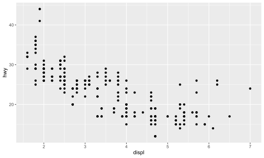
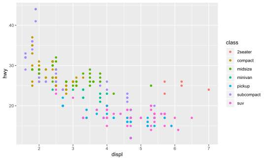
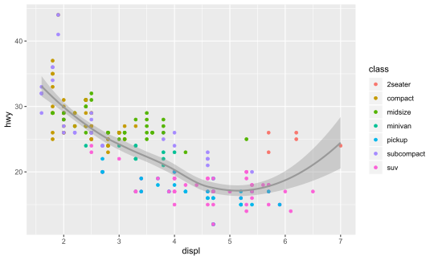
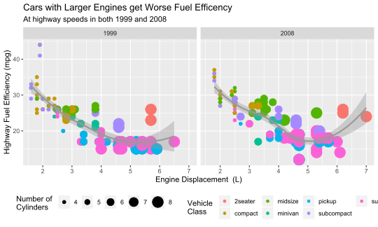
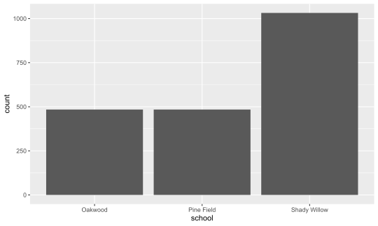
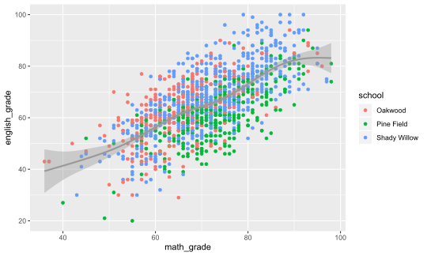
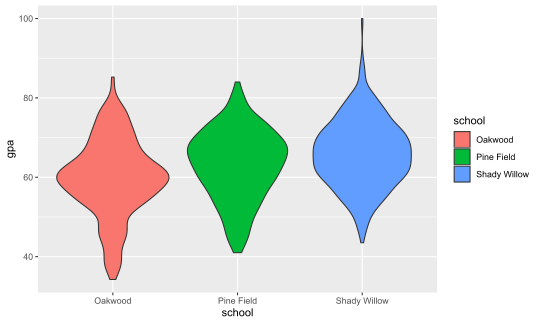
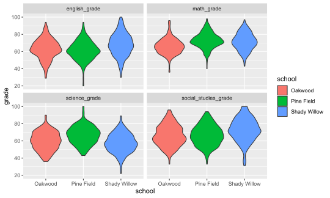

## About the Course
- All the code for the course and a document version of the presentation are available at [https://github.com/tonofshell/r-crash-course/](https://github.com/tonofshell/r-crash-course/)
- The course covers four broad areas of Data Science in R (plus setting up R)
  - Data Structures
  - Data Wrangling
  - Communicating Results
  - Programming
  
# Introduction

## What is R?

- According to [official R Project website](https://www.r-project.org/), *"R is a free software environment for statistical computing and graphics."*
- While the typical R environment is typically called just 'R', it is actually made of several components from different sources
  - __R Language and Interpreter__ 
    - These define the rules and syntax for the language, and converts R code into code your computer can understand
    - Distributed by the R Project on The Comprehensive R Archive Network (CRAN) repository
  - __R Packages__ 
    - These include first and third party software additions to add functionality to the language 
    - Distributed in the base installation of R, on the CRAN repository, on Git Hub, and by other means
  - __R Integrated Development Environment (IDE)__
    - This allows you to interact with the language and more easily produce, test, and understand code
    - The R base installation includes a very rudimentary IDE (this is almost never used)
      - R Studio is a third party open source IDE that is widely considered the best (and default) IDE for R
      
## What is so great about R?

Pros                     Cons                         
-----------------------  -----------------------------
Open Source              Provides a specific tool-set 
Highly reproducible      Not always intuitive         
Free to use              Variance in quality          
Rich package ecosystem   Performance can be slower    

## Who is R for? (and where do I get it?)

- R is primarily for researchers in the data science realm
  - However, R includes tools for working with a wide range of data, even more qualitative methods
  - The `ggplot2` package in R is often referred to as the 'gold standard' for data visualization
- Due in part to their open source nature, R and R Studio are available for macOS, Windows, Linux and web(!?)
  - On a personal computer you can install the appropriate r-base files from [the CRAN](https://cran.r-project.org/) and R Studio from [the R Studio website](https://www.rstudio.com/products/rstudio/download/#download)
  - You can also use R and R Studio from any web browser using [R Studio Cloud](https://rstudio.cloud)
    - This does mean any data used for analysis is stored in the cloud __*NOT*__ on your computer
    - R Studio Cloud is built off of [R Studio Server](https://www.rstudio.com/products/rstudio/download-server/) which anyone (with the right motivation and technical skills) can use to run their own browser-accessible R Studio experience
    
## Additional Resources
- This course is geared to providing a sturdy base to get you working in R and R Studio
- However, the world of R is immense, with many more topics and packages than we could ever hope to cover
- Many references will be made to [R for Data Science](https://r4ds.had.co.nz/) by Garrett Grolemund and Hadley Wickham
  - Links to relevant sections will be provided whenever possible, but feel free to read the entire eBook at your leisure (it's free)!
- Modeling in R will only be touched on very briefly and broadly, as the modeling process is highly dependent on the package used
  - The help documentation will be your best friend, which goes for other packages and topics as well
- You can page through the content of this presentation in the form of a regular webpage [here](presentation.md)


# Getting Started

## R Studio's User Interface
- R Studio is split into four main panes
- The tabs in each pane depend on the current context, with additional tabs appearing when other features have been activated


## Upper Left Pane - Source


- Shows the source code for your open files
- Each open file gets a tab
- Tabs get different buttons as applicable (like the `Run` button for R files)

## Lower Left Pane - Command Line


- The `Console` tab shows the R console allowing you to issue and view the output of R commands
- The `Terminal` tab gives access to the system terminal
- Other tabs appear depending on the context of what you are doing and generally show the statuses of other relevant systems (e.g knitting of an R Markdown document)

## Upper Right Pane - Environment et. al. 


- The `Environment` tab shows all the variables in your current environment and allows you to view them
- The `History` tab shows all the commands you have run this session
- The `Connections` tab allows you to connect to a database

## Lower Right Pane - Everything Else


- The `File` tab shows files in the current directory and allow for moving, copying, deleting, and renaming files
- The `Packages` tab allows for the installation, loading, and unloading of packages
- The `Help` tab provides searchable access to the help files for all installed packages
- The `Plots` and `Viewer` tabs display certain objects and files, they are automatically selected when an object to be plotted or viewed is generated

## Your First R Script
- __Make a new project__
  - Go to `File` > `New Project...` > `New Directory` > `New Project`
  - Give your first project a name, like *'First Project'*
  - Select the folder you want to save this project in
  - Keep all other options unchecked
  - Click `Create Project`
- __Create a new R script__
  - Go to `File` > `New File` > `R Script`
  - In the source editor for the script type `"Hello world"`
  - Save the script under a meaningful name like `hello_world`
  - In the upper right corner of the source tab, click `Run` > `Run All`
  - "Hello world" should print out in the `Console` tab below
- __The Result__

```
## [1] "Hello world"
```

## Variable Assignment
- Assigning a variable allows for that value to be "saved" and referred to later in your code
- It also makes your code more readable, by giving context to what each part is
- Variable names must start with a letter and be followed by an assignment operator (either `=` or `<-`)
  - Variable names should be all lower case, with words separated by a period (`.`) or underscore (`_`) 
  - Both assignment operators work the same, but the equals sign can also refer to other operations in different contexts 
  - Which should you use?
    - Using a period in names and `<-` as an assignment operator is traditional in R, but most other languages do not follow this convention
    - Using underscores in names and equals sign assignment operators is likely more readable to those familiar with other programming languages, but whatever you choose, pick a convention and use it consistently throughout a project
- Just executing the variable name will print out its value(s)
    

```r
# Create a variable for your favorite number
fav_num = 7
fav.num <- 7

# ...or your favorite color
fav_color = "blue"
fav_color
```

```
## [1] "blue"
```

```r
# Save a vector (a group) of numbers
evens = c(2, 4, 6, 8, 10)
```


## More Things to Try
- Enter each of these into a line in your script and run it or type each into the console and hit enter to run each command individually

```r
# Arithmetic
(2 + 2) * 4^2
```

```
## [1] 64
```

```r
# Use a function
mean(evens)
```

```
## [1] 6
```

```r
# Use variables
fav_num + 3
```

```
## [1] 10
```

```r
fav_num + evens
```

```
## [1]  9 11 13 15 17
```

## What did we learn?
- Whether you run a command from a script or the console the result is the same
  - A script is just a way to save a sequence of commands to be reproduced later
- Arithmetic works mostly the way you would expect it to
  - Any expression that returns a result is displayed in the console
- Variables allow you to preserve a value to use later in the session
  - Setting a variable does not return a result, although we can see the value of our variable in the `Environment` tab or by entering the name of the variable as a command
- Vectors can be created using the `c()` function and hold any number of the same type of object (e.g all numbers or all text)
- Functions can be applied over vectors
  - However, how they are applied will vary (e.g. mean vs. +)


# Data Structures

## Vector Basics
- Vectors are a collection of the same type of object, created using the `c()` function (e.g. `c(1, 2, 3)` or `c("a", "b", "c")`)
- Scalars are a single value (e.g. `1` or `"a"`)
  - However in R scalars are just vectors of length one, so `1` is the same as `c(1)`
- Vectors have two properties
  - A length
  - A type
- While vectors can have any length, there are only six basic types called Atomic Vectors, four of which are commonly used
  - Numeric (e.g. `1` or `5.37`)
    - There are two types of numeric vectors
      - Integer (e.g. `1`)
      - Double  (e.g. `5.37`)
  - Character (e.g. `"hello"` or `'hello'`)
  - Logical (e.g. `TRUE` or `FALSE`)

## Working with Vectors
- The `c()` function can append one vector to another
- Brackets after a reference to a vector will select value(s) at specific indices
  - R is a one-indexed language, meaning the initial value in a vector is stored at index 1

```r
c(c(1,2), c(3,4))
```

```
## [1] 1 2 3 4
```

```r
pets = c("dog", "fish", "cat", "frog", "hamster")
first_pet = pets[1]
first_pet
```

```
## [1] "dog"
```

```r
mammals = pets[c(1,3,5)]
mammals
```

```
## [1] "dog"     "cat"     "hamster"
```

## Converting Vectors
- Vectors can be converted to a different compatible type
- Some operations may convert vectors to a compatible type on the fly, called coercion

```r
as.logical(c(1, 0, 0, 1))
```

```
## [1]  TRUE FALSE FALSE  TRUE
```

```r
as.logical(c("TRUE", "FALSE", "F", "T"))
```

```
## [1]  TRUE FALSE FALSE  TRUE
```

```r
as.numeric(c(TRUE, FALSE, F, T))
```

```
## [1] 1 0 0 1
```

```r
as.numeric(c("1", "0", "0", "1"))
```

```
## [1] 1 0 0 1
```

```r
as.character(c(TRUE, FALSE, F, T))
```

```
## [1] "TRUE"  "FALSE" "FALSE" "TRUE"
```

```r
as.character(c(1, 0, 0, 1))
```

```
## [1] "1" "0" "0" "1"
```

```r
sum(c(T, F, T, F))
```

```
## [1] 2
```


## Sequences
- A sequence is a special way of generating a numeric vector
- Each item in the vector increases or decreases a constant amount from the previous item
- Sequences can be defined in two ways
  - The `seq()` function
    - The `by` argument specifies the amount to increment, by default it is 1
  - The `:` operator

```r
1:5
```

```
## [1] 1 2 3 4 5
```

```r
seq(1, 5)
```

```
## [1] 1 2 3 4 5
```

```r
seq(1, 10, by = 3)
```

```
## [1]  1  4  7 10
```

## Manipulating Character Vectors
- There are some special functions to work with character vectors
- The most notable is `paste()` which concatenates (combines) multiple character vectors
- There are other built-in functions for working with character vectors, however it is suggested to use their alternatives from the `stringr` tidyverse package (named after 'strings' which is what many other languages call a single-length character vectors)
  - These functions are vectorized and return a list of the results
  - The most used `stringr` functions are likely `str_sub()` which returns a portion of a character vector and `str_split()` which splits a character vector into multiple parts by a sequence of characters

```r
paste("hello", "there", "friends")
```

```
## [1] "hello there friends"
```

```r
paste("hello", "there", "friends", sep = "_")
```

```
## [1] "hello_there_friends"
```

```r
str_sub("grades_2020", start = 8)
```

```
## [1] "2020"
```

```r
str_split("grades_2020", pattern = "_")
```

```
## [[1]]
## [1] "grades" "2020"
```

## Making Logical Vectors
- Logical vectors can also be made using different comparison operators including `==`, `!=`, `<`, `>`, `<=`, `>=`, `%in%`

```r
1:5 <= 3
```

```
## [1]  TRUE  TRUE  TRUE FALSE FALSE
```

```r
1:5 == 4
```

```
## [1] FALSE FALSE FALSE  TRUE FALSE
```

```r
c("hello", "there", "friend") == "there"
```

```
## [1] FALSE  TRUE FALSE
```

```r
"hello" %in% c("hello", "there", "friend")
```

```
## [1] TRUE
```

## Logical Operators
- There are special operators for logical values
  - The 'and' operator (`&`) returns `TRUE` when two both values evaluate to `TRUE`
  - The 'or' operator (`|`) returns `TRUE` when either of two values evaluate to `TRUE`
  - The 'not' operator (`!`) returns true when a value evaluates to `FALSE`
- These operations are vectorized

```r
c(TRUE & TRUE, TRUE & FALSE)
```

```
## [1]  TRUE FALSE
```

```r
c(TRUE | TRUE, TRUE | FALSE)
```

```
## [1] TRUE TRUE
```

```r
c(!TRUE, !FALSE)
```

```
## [1] FALSE  TRUE
```

```r
rep(TRUE, 5) & rep(TRUE, 5)
```

```
## [1] TRUE TRUE TRUE TRUE TRUE
```


## Finding the Type of a Vector
- Typically R automatically assigns a type to the vector
- You can test the type of a vector using the `typeof()` function

```r
typeof("hello")
```

```
## [1] "character"
```

```r
typeof(6)
```

```
## [1] "double"
```

```r
typeof(TRUE)
```

```
## [1] "logical"
```

## A Vector Inside a Vector
- Other objects are made up vectors
  - Lists 
    - A list can contain an unlimited number of vectors or other lists (multi-dimensional)
  - Data-frame / Tibble / Matrix
    - A list of vectors, where each vector is the same length and represents a column of values (two-dimensional)
    - Data-frames or Tibbles can have different types for each column
    - For matrices all columns must be the same type (typically numeric)
- To learn more about vectors and vector-based objects in [R for Data Science: Chapter 20](https://r4ds.had.co.nz/vectors.html)

## Tibbles
- Data is usually distributed / imported in the form of a data-frame or tibble
  - A tibble is an updated version of the data-frame included in the `tidyverse` package
    - Tibbles only display the first 10 rows when printed to the console and do not convert column types, unlike data-frames
    - A data-frame can be coerced to a tibble with the `as_tibble()` function 
- Since the tibble is __NOT__ included with the base R packages we must install and load the `tidyverse` package
  - In the `Packages` tab there is an `Install` button, click that and type 'tidyverse' and install it
  - Once a package is installed you can load it using the `library()` function, run `library(tidyverse)` from a script or the console to load the `tidyverse` package
  - The `tidyverse` package is actually several data science packages that follow a common 'tidy' analysis philosophy and are all installed and loaded together 
    - You can learn more about it on the [tidyverse website](https://www.tidyverse.org/)
    
## Using a Tibble
- Now that the `tidyverse` package is loaded we can begin to use tibbles for storing data
  - Use the `tibble()` function to create a new tibble
  - Specify the name and data for each column as a new named argument (e.g. `tibble(grades = c("A", "B", "A", "D"), age = age_vector`))
    - Notice that you can pass in a variable that refers to a vector that has been previously defined
- Calling the name of a tibble variable prints out the first 10 rows of the tibble
  - View all of the tibble by clicking on its information in the `Environment` tab
- There are a few ways to select rows and / or columns to view / use
  - Get a column with `my_tibble$col_name`, `select(my_tibble, "col_name")`, `my_tibble["col_name"]`, or `my_tibble[col_index]`
    - Selecting an individual column using the latter two methods will return a tibble __NOT__ a vector 
      - For some functions like `mean()`, you may need to use `unlist()` to convert a single-columned tibble to a vector
  - Get a row with `my_tibble[row_index, ]` (notice the comma after `row_index`)
  - Get a value at a location as a tibble with `my_tibble[row_index, col_index]`
- Get the dimensions of a tibble with `nrow(my_tibble)` for the number of rows and `ncol(my_tibble)` for the number of columns

## Trying a Tibble
- The `iris` data-set gives different measurements for 150 different irises of 3 species
- Create a tibble of the iris data-set using `as_tibble(iris)` with the variable name `iris_data`
- Answer the following questions:
  1. What is the mean sepal length?
  1. What is the median petal width?
  1. What is the mean petal area? (Hint: Vectors of same lengths can be multiplied by each other)
  1. Are there an equal number of each species? (Hint: the `table()` function might be useful)

## Trying a Tibble | Answers

```r
iris_data = as_tibble(iris)
mean(iris_data$Sepal.Length)
```

```
## [1] 5.843333
```

```r
median(iris_data$Petal.Width)
```

```
## [1] 1.3
```

```r
mean((iris_data$Petal.Length * iris_data$Petal.Length))
```

```
## [1] 17.21807
```

```r
table(iris_data$Species)
```

```
## 
##     setosa versicolor  virginica 
##         50         50         50
```

## Trying a Tibble | Takeaways
- Oftentimes there are many ways to do the same thing
- There are __*MANY*__ different packages and functions to make your life easier
  - To learn more about a function, package, or included data-set, search for it in the `Help` tab or, if you know the name, use the `?` function (e.g. `?iris`)
- The `iris` data-set contains a special kind of vector for the species variable - called a factor
  - This is essentially a categorical variable
  - Factors have levels (categories) which each have a label assigned to them
  - Can be unordered (as in the case of species) or ordered (as in the case of a Likert scale)
  

# Data Wrangling

## What is Data Wrangling?
- The process of taking the data you have and putting it into the form you need for your analysis
- Includes a wide range of processes and tools
  - Importing / converting
  - Variable creation
  - Merging
  - Reshaping 
  - Cleaning
- This is usually the most time consuming part of any data project

## But First, Some Programming Basics
- Data wrangling can get complex and messy pretty fast
- Functions in R are passed arguments which are the 'inputs' of the function
  - Arguments must be passed into the function in the same order they are defined (e.g. for `my_function(a, b, c)` executing `my_function(1, 2, 3)` defines `a` as `1`, `b` as `2`, and `c` as 3)
  - Arguments can be specified in any order if the name of the argument is included with it (e.g. `my_function(b = 2, c = 3, a = 1)` is the same as before, even though the order does not match the function's definition)
- In Base R, if you need to use many functions in succession, you have three options
  - Create lots of variables
```
a_1 = function_one(x)
a_2 = function_two(a_2)
a_3 = function_three(a_3)
```
  - Overwrite existing variables
```
a = function_one(x)
a = function_two(a)
a = function_three(a)
```  
  - Create many nested functions
```
a = function_three(function_two(function_one(x)))
```
  - This might be fine for a few operations, but more complex combinations quickly become an unreadable and hard to debug mess
- In research, we want our analyses to be transparent and reproducible, in Base R this is difficult to achieve for complex code 
- For these reasons the pipe operator was created and included in the tidyverse

## Becoming an R Plumber
- The pipe operator (`%>%`) directs a variable or the output of a function into the input arguments of another function

*So our previous example of*
```
a = function_three(function_two(function_one(x)))
```
*...becomes...*
```
a = x %>% function_one() %>% function_two() %>% function_three()
```
- Wa-hoo! Much better! But what about functions with multiple arguments, like the `round()` function (which rounds numbers to a specified amount of decimal places)?

*Simple!*

```r
round(pi, 3)
```

```
## [1] 3.142
```
*...becomes...*

```r
pi %>% round(3)
```

```
## [1] 3.142
```
  
## Advanced R Piping
- By default the output is piped into the first argument of the next function
- However, sometimes we might need to pipe data elsewhere
  - The dot (`.`) tells the pipe where else to pipe the data into, in addition to the first argument

```r
iris_data %>% select(Sepal.Length) %>% as_vector() %>% tibble(Standardized.Length = (. / mean(.)) ) %>% head(1)
```

```
## # A tibble: 1 x 2
##       . Standardized.Length
##   <dbl>               <dbl>
## 1   5.1               0.873
```
  - A dot at the beginning of the chain creates a function you can call later

```r
std_var = . %>% as_vector() %>% tibble(Standardized.Var = (. / mean(.)) )
iris_data %>% select(Sepal.Length) %>% std_var() %>% head(1)
```

```
## # A tibble: 1 x 2
##       . Standardized.Var
##   <dbl>            <dbl>
## 1   5.1            0.873
```
  - Putting curly brackets (`{}`) around a function, causes the data to __*ONLY*__ be piped to the dots

```r
iris_data %>% select(Sepal.Length) %>% as_vector() %>% {tibble(Standardized.Length = (. / mean(.)) )} %>% head(1)
```

```
## # A tibble: 1 x 1
##   Standardized.Length
##                 <dbl>
## 1               0.873
```
  - Other pipe operators and functions to pair with pipes exist in the `magrittr` package

## Tidy Data
- Data is easiest to work with when it is tidy, defined by [R for Data Science](https://r4ds.had.co.nz/tidy-data.html#tidy-data-1) when:
  1. Each variable has its own column.
  1. Each observation has its own row.
  1. Each value has its own cell.
- You will commonly need to convert from long to wide tibbles or vice-versa to tidy data
  - `pivot_wider()` converts from long data to wide data
  - `pivot_longer()` converts from wide to long data
  - `unite()` combines multiple columns into a single new column
  - `separate()` splits a column into multiple new columns
- Functions from the `stringr` package can be used to modify character vectors before or after this process
  
## Using `pivot_wider()`

```r
table2 %>% head(4)
```

```
## # A tibble: 4 x 4
##   country      year type          count
##   <chr>       <int> <chr>         <int>
## 1 Afghanistan  1999 cases           745
## 2 Afghanistan  1999 population 19987071
## 3 Afghanistan  2000 cases          2666
## 4 Afghanistan  2000 population 20595360
```

```r
table2 %>% pivot_wider(names_from = "type", values_from = "count") %>% head(4)
```

```
## # A tibble: 4 x 4
##   country      year cases population
##   <chr>       <int> <int>      <int>
## 1 Afghanistan  1999   745   19987071
## 2 Afghanistan  2000  2666   20595360
## 3 Brazil       1999 37737  172006362
## 4 Brazil       2000 80488  174504898
```

## Using `pivot_longer()`

```r
table1 %>% head(4)
```

```
## # A tibble: 4 x 4
##   country      year cases population
##   <chr>       <int> <int>      <int>
## 1 Afghanistan  1999   745   19987071
## 2 Afghanistan  2000  2666   20595360
## 3 Brazil       1999 37737  172006362
## 4 Brazil       2000 80488  174504898
```

```r
table1 %>% mutate_all(as.character) %>% pivot_longer(cols = everything()) %>% head(4)
```

```
## # A tibble: 4 x 2
##   name       value      
##   <chr>      <chr>      
## 1 country    Afghanistan
## 2 year       1999       
## 3 cases      745        
## 4 population 19987071
```

## Using `unite()`
- Specifying the separator is optional but can be specified with the `sep` argument (e.g. `sep = "_"`)

```r
table1 %>% head(4)
```

```
## # A tibble: 4 x 4
##   country      year cases population
##   <chr>       <int> <int>      <int>
## 1 Afghanistan  1999   745   19987071
## 2 Afghanistan  2000  2666   20595360
## 3 Brazil       1999 37737  172006362
## 4 Brazil       2000 80488  174504898
```

```r
table1 %>% unite("info", cases, population) %>% head(4)
```

```
## # A tibble: 4 x 3
##   country      year info           
##   <chr>       <int> <chr>          
## 1 Afghanistan  1999 745_19987071   
## 2 Afghanistan  2000 2666_20595360  
## 3 Brazil       1999 37737_172006362
## 4 Brazil       2000 80488_174504898
```
## Using `separate()`
- Specifying the separator is optional but can be specified with the `sep` argument (e.g. `sep = "/"`)

```r
table3 %>% head(4)
```

```
## # A tibble: 4 x 3
##   country      year rate           
##   <chr>       <int> <chr>          
## 1 Afghanistan  1999 745/19987071   
## 2 Afghanistan  2000 2666/20595360  
## 3 Brazil       1999 37737/172006362
## 4 Brazil       2000 80488/174504898
```

```r
table3 %>% separate(rate, c("cases", "population")) %>% head(4)
```

```
## # A tibble: 4 x 4
##   country      year cases population
##   <chr>       <int> <chr> <chr>     
## 1 Afghanistan  1999 745   19987071  
## 2 Afghanistan  2000 2666  20595360  
## 3 Brazil       1999 37737 172006362 
## 4 Brazil       2000 80488 174504898
```

## Excluding Variables
- Commonly in R, the dash (`-`) is used to specify 'all but this', as with
  - Negative indices: `my_vector[-5]` would return all the items in the vector except the one at index 5
  - Negative variables: `my_tibble %>% select(-age)` would return a tibble with every variable from `my_tibble` except `age`
- Most functions in the tidyverse allow the exclusion of variables from a process by passing their names with a dash in front as the last arguments

```r
table1 %>% head(4)
```

```
## # A tibble: 4 x 4
##   country      year cases population
##   <chr>       <int> <int>      <int>
## 1 Afghanistan  1999   745   19987071
## 2 Afghanistan  2000  2666   20595360
## 3 Brazil       1999 37737  172006362
## 4 Brazil       2000 80488  174504898
```

```r
table1 %>% pivot_longer(cols = -c(country, year), names_to = "type", values_to = "count",) %>% head(4)
```

```
## # A tibble: 4 x 4
##   country      year type          count
##   <chr>       <int> <chr>         <int>
## 1 Afghanistan  1999 cases           745
## 2 Afghanistan  1999 population 19987071
## 3 Afghanistan  2000 cases          2666
## 4 Afghanistan  2000 population 20595360
```

## Filtering a Data-set
- Filtering allows to subset data by the specific values of a given variable
- The `filter()` function takes a comparison of a variable and a value and returns each row where that comparison is `TRUE`

```r
table1 %>% filter(country == "China")
```

```
## # A tibble: 2 x 4
##   country  year  cases population
##   <chr>   <int>  <int>      <int>
## 1 China    1999 212258 1272915272
## 2 China    2000 213766 1280428583
```

```r
table1 %>% filter(cases > 3000)
```

```
## # A tibble: 4 x 4
##   country  year  cases population
##   <chr>   <int>  <int>      <int>
## 1 Brazil   1999  37737  172006362
## 2 Brazil   2000  80488  174504898
## 3 China    1999 212258 1272915272
## 4 China    2000 213766 1280428583
```

## Creating or Modifying Variables
- While there are many ways to create or modify variables, the recommended way is to use the `mutate()` function
- The `mutate()` function takes a name for a variable and any code to generate that variable

```r
table1 %>% mutate(rate = cases / population)
```

```
## # A tibble: 6 x 5
##   country      year  cases population      rate
##   <chr>       <int>  <int>      <int>     <dbl>
## 1 Afghanistan  1999    745   19987071 0.0000373
## 2 Afghanistan  2000   2666   20595360 0.000129 
## 3 Brazil       1999  37737  172006362 0.000219 
## 4 Brazil       2000  80488  174504898 0.000461 
## 5 China        1999 212258 1272915272 0.000167 
## 6 China        2000 213766 1280428583 0.000167
```

```r
table1 %>% mutate(year = year %>% as.character() %>% str_sub(3))
```

```
## # A tibble: 6 x 4
##   country     year   cases population
##   <chr>       <chr>  <int>      <int>
## 1 Afghanistan 99       745   19987071
## 2 Afghanistan 00      2666   20595360
## 3 Brazil      99     37737  172006362
## 4 Brazil      00     80488  174504898
## 5 China       99    212258 1272915272
## 6 China       00    213766 1280428583
```

## Importing Data
- Most likely the data you need to analyze will not come as a tibble built-in to an R package
- Included in the tidyverse are the `readr`, `haven`, and `readxl` packages for importing different file types directly to tibbles in R
  - `readr` includes functions to read standard delimited file types such as CSV and TSV files
  - `haven` includes functions to read files from other stats programs such as Stata, SPSS, and SAS 
  - `readxl` includes functions to read Excel files 
- Other packages can add support for reading other types of files
  - `sf` provides tools for working with GIS data such as shapefiles
  - `jsonlite` adds functionality for reading and writing to JSONs
  - If it exists, there's probably an R package to open it
    - However, some packages read data as a data frame and will need to be converted to a tibble before proceeding
- The `here()` function in the `here` package makes specifying a file path much easier
  - There is a good example of its benefits and uses [on GitHub](https://github.com/jennybc/here_here)

## Everything Else
- Data-sets are rarely complete, and may be explicitly or implicitly missing values
  - Explicitly missing values are defined in R by `NA`
  - Oftentimes missing values will need to be omitted, the `na.omit()` function will remove any rows that have any missing values
  - More about accounting for missing values is covered in [this chapter](https://r4ds.had.co.nz/tidy-data.html#missing-values-3) of R for Data Science
- Joining different data-sets is a common problem, but unfortunately it was too time consuming to include here
  - The [chapter on relational data](https://r4ds.had.co.nz/relational-data.html), covers this in detail by using data on flights in and out of NYC airports 
  
## Analyzing Student Data
1. Download the CSV file [student_data.csv](https://github.com/tonofshell/r-crash-course/releases/latest/download/student_data.csv) and copy it to your project directory
1. Install and import the `here` package
1. Import the data using the appropriate function from the `readr` package (learn more about the package on the [tidyverse website](https://readr.tidyverse.org/))
1. Rearrange the data to only have variables for first, middle, and last names, school, year, and math, English, science, and social studies grades
1. Calculate the GPA for each student for each year (Hint: it may be easier to __NOT__ use the `mean()` function)
1. Find the average GPA for each school in 2018 (This can be done all in one step with the `aggregate()` function for bonus points)

## Analyzing Student Data | Answers

```r
library(here)
student_data = read_csv(here("student_data.csv"))
```


```r
gathered_student_data = student_data %>% select(-age, -grade_level) %>% 
  pivot_longer(c(-first, -middle, -last, -school), names_to = "key", values_to = "grade") %>%
  separate(key, c("class", "year"), sep = "__") 
gathered_student_data %>% head(4)
```

```
## # A tibble: 4 x 7
##   first     middle last   school  class                year  grade
##   <chr>     <chr>  <chr>  <chr>   <chr>                <chr> <dbl>
## 1 Krimhilde Yuri   Hierro Oakwood math_grade           2015     NA
## 2 Krimhilde Yuri   Hierro Oakwood english_grade        2015     NA
## 3 Krimhilde Yuri   Hierro Oakwood science_grade        2015     NA
## 4 Krimhilde Yuri   Hierro Oakwood social_studies_grade 2015     NA
```

```r
final_student_data = gathered_student_data %>% pivot_wider(names_from = "class", values_from = "grade") %>% 
  mutate(gpa = (math_grade + english_grade + science_grade + social_studies_grade) / 4)
final_student_data %>% head(4)
```

```
## # A tibble: 4 x 10
##   first middle last  school year  math_grade english_grade science_grade
##   <chr> <chr>  <chr> <chr>  <chr>      <dbl>         <dbl>         <dbl>
## 1 Krim~ Yuri   Hier~ Oakwo~ 2015          NA            NA            NA
## 2 Krim~ Yuri   Hier~ Oakwo~ 2016          72            64            64
## 3 Krim~ Yuri   Hier~ Oakwo~ 2017          72            58            63
## 4 Krim~ Yuri   Hier~ Oakwo~ 2018          65            57            62
## # ... with 2 more variables: social_studies_grade <dbl>, gpa <dbl>
```

```r
# the easy way, repeat for each school
final_student_data %>% filter(year == 2018, school == "Oakwood") %>% select(gpa) %>% unlist() %>% mean()
```

```
## [1] 60.55165
```

```r
# the harder way
final_student_data %>% filter(year == 2018) %>% {aggregate(.$gpa, by = list(school = .$school), mean)}
```

```
##         school        x
## 1      Oakwood 60.55165
## 2   Pine Field 62.76240
## 3 Shady Willow 66.17926
```

# Communicating Results

## Data Visualization
- Aids in the discovery and understanding of relationships in the data
- Data visualization is an essential part of the data science process, and an important method for conveying results, especially to other researchers without data science experience
- In R, there are functions for data visualization in the built-in `graphics` package, such as the `plot()` and `hist()` functions
  - While these can be sufficient for basic visualizations, generating complex visualizations is much more difficult
- In response to this learning curve Hadley Wickham, author of most of the tidyverse packages, created `ggplot2` a data visualization package which follows a 'grammar of graphics'
  - `ggplot2` is one of the world's most popular data visualization tools, used by world renowned organisations such as the New York Times and FiveThirtyEight, and has been downloaded millions of times
  - Its simplicity in building and customizing visualizations is desirable to amateurs and professionals alike, and numerous packages have expanded its philosophy to other aspects of data visualization
  
## `ggplot2` Basics
- `ggplot2` layers components on top of each other to build a visualization
- The process is started with the `ggplot()` function which specifies a data source and any default aesthetic mappings or settings to use
  - `ggplot()` accepts data in data frame or tibble form
  - Aesthetic mappings, generated with the `aes()` function, connect a dimension of data to a dimension of the visualization
- Next comes one or more geometry layers, each corresponding to a type of visualization to include    
    - Each additional geometry layer can inherit the default aesthetic mappings and settings, if possible, or specify different ones
- Other layers can be added to adjust other parameters, such as facets, labels, scales, and themes
- All of these layers are linked together to form one visualization using the addition operator(`+`)

## Making a Simple Visualization
1. Select a data source - this can be piped in, which is useful if the data needs to be wrangled into the correct form for the visualization
2. Specify default aesthetic mappings - `x`, `y`, `color`, and `fill` are the most common, but some geometries will use more or only a portion of these
3. Select a geometry function (or several) - each of these are prefaced by `geom_` (e.g. `geom_point()`)
4. Save to a variable to add more layers or view later

```r
displ_year_plot = ggplot(mpg, aes(x = displ, y = hwy)) + geom_point()
displ_year_plot
```

<!-- -->

## Making a Slightly Less Simple Visualization
- Specifying `color` in an aesthetic maps changes in color based to a variable, creating a legend
- Specifying `color` in a geometry simply sets the same color for all elements in that geometry


```r
displ_year_plot = ggplot(mpg, aes(x = displ, y = hwy)) + geom_point(aes(color = class))
displ_year_plot
```

<!-- -->

```r
displ_year_plot + geom_smooth(color = "grey60")
```

<!-- -->

## Making a Complicated Visualization
- Functions prefixed in `scale_` can alter the scale used for a specific dimension
  - Here `scale_radius()` adjusts the `size` aesthetic by the radius, the default `scale_size()` adjusts the area
- The `labs()` function allows for the definition of labels
- A facet arranges multiple visualizations which each use a different subset based on a variable
- Themes alter the position, size, and other attributes of objects
- This is probably a bad visualization because __*too much*__ has been stuffed into it

```r
mpg %>% arrange(-cyl) %>% ggplot(aes(x = displ, y = hwy)) + 
  geom_point(aes(color = class, size = cyl)) + 
  geom_smooth(color = "grey60") + 
  scale_radius(range = c(2, 7)) + 
  facet_wrap(~ year) + theme(legend.position = "bottom") + 
  labs(title = "Cars with Larger Engines get Worse Fuel Efficiency", subtitle = "At highway speeds in both 1999 and 2008", 
       x = "Engine Displacement  (L)", y = "Highway Fuel Efficiency (mpg)", color = "Vehicle \nClass", size = "Number of \nCylinders")
```

<!-- -->

## Introduction to R Markdown
- R scripts are great for saving code, but if you want to make a document or report, it involves a tedious process of exporting results to be inserted into a Word or Latex document 
- R Markdown attempts to solve this problem by combining R code with a formatted document
- R Markdown code can still be easily read while also allowing for detailed formatting options
- R Markdown files are 'knitted' into a common document type such as HTML (webpage), PDF, Word document, and others (this presentation was completely made with R Markdown!)
- It allows for a completely reproducible document of which any changes can easily be tracked by version control software - ideal for research purposes
- A R Markdown file is broken into three basic parts
  - The header defines a title, author, and date, as well as the options for knitting into a final document
  - Markdown sections allow for rich formatted text
  - Code blocks allow for sections of code, where the code and output can be made viewable in the final knitted document

## Making an R Markdown document
- R Studio will generate a blank R Markdown file with some basic parts by selecting `R Markdown` from the `File` > `New File...` menu
  - A dialog box will give you some basic options for your R Markdown file
- Create a new code block by pressing `Ctrl` + `Alt` + `i` or on macOS `Cmd` + `Opt` + `i`
- Name a code block by adding a space and a name after the r in the code block header (e.g. `{r code-block-name}`)
- The gear to the right of the code block gives options for displaying code and/or the output of code
- The play button allows for an individual code block to be run, or all code blocks can be run from the `Run` menu
  - When the R Markdown file is knitted all the code blocks are run except for any that are cached (learn about caching and other code block options [here](https://bookdown.org/yihui/rmarkdown/r-code.html))

## Basic Markdown
- R Markdown is based off of Markdown which is a basic syntax markup language for formatting text
- A line of header text is started with an octothorp (`#`) followed by a space (e.g. `# My Big Fancy Header`)
  - Subheadings can be created by adding more octothorps 
  ```
    # Main Heading 1
    ## Sub-heading 1.1
    ### Sub-heading 1.1.1
  ```
- Unordered lists can be made by starting each line with a dash (`-`), asterisk, (`*`), or addition signs (`+`) followed by a space
- Ordered lists can be made by starting each line with a number and a period (e.g `1.`) followed by a space
  - The number you use does not matter, R changes it to the correct number if it is wrong
- Text can be *italicized* by surrounding it in single asterisks or underscores (e.g. `*italics*` or `_also italics_`)
- Text is __bolded__ by surrounding it in double asterisks or underscores (e.g. `**bold**` or `__also bold__`)
  - Combine them to __*do both*__ (e.g. `__*bold and italics*__`)
- ~~Strikethrough text~~ can be displayed by using double tildes (e.g. `~~strikethrough~~`)
- Make a horizontal rule by placing three or more hyphens, asterisks, or underscores on a line

## Links and Things
- Links can be made with a display text surrounded by square brackets followed by the URL surrounded by a set of parentheses (e.g. `[A Link to Google](http://google.com)`) [A Link to Google](http://google.com)
- Pictures can be added in a similar manner but an exclamation mark is added first (e.g ``)

- Links and pictures can be linked to a file on your computer, the web, or even to another section of the document.
- R Markdown can do a lot more! The free eBook [R Markdown: The Definitive Guide](https://bookdown.org/yihui/rmarkdown/), spills all of its secrets

## Visualizing Student Data
Create an R Markdown document knitted into HTML with visualizations to answer the following questions:

1. Is one school overrepesented in the data-set?
1. Is there a relationship between math and English grades?
1. Which school has the highest GPAs?
1. Do grades by subject vary by school?

## Visualizing Student Data | Answers

```r
final_student_data %>% ggplot(aes(x = school)) + geom_bar()
```

<!-- -->

```r
final_student_data %>% ggplot(aes(x = math_grade, y = english_grade, color = school)) + geom_point() + geom_smooth(color = "grey60")
```

<!-- -->

```r
final_student_data %>% ggplot(aes(x = school, y = gpa, fill = school)) + geom_violin()
```

<!-- -->

```r
gathered_student_data %>% ggplot(aes(x = school, y = grade, fill = school)) + geom_violin() + facet_wrap(~class)
```

<!-- -->

# Programming

## Programming in R
- R is not only a statistical environment but a programming language
  - While R is not a general purpose programming language like Python or Java, it has many of the same components
- In certain circumstances the `print()` function may be necessary to print to the console
  - In most loops or functions only the `print()` function outputs to the console, in contrast to the rest of 
- R is an interpreted language which means the R console must convert R code into a language that the operating system can understand
- R code can include comments, lines are not executed that explain what code does, by starting a line with an octothorp (`#`)

## `if` Statement
- An `if` statement executes code if a logical condition evaluates to true

```r
grade_level = 12

if (grade_level > 8) {
  print("high school")
}
```

```
## [1] "high school"
```

## `if else` Statement
- An `if else` statement executes a section of code if a logical condition evaluates to true, or a different section of code if it does not
  - ``if else` statements can be strung together to test for multiple conditions

```r
grade_level = 7

if (grade_level > 8) {
  print("high school")
} else if(grade_level > 5) {
  print("middle school")
} else {
  print("elementary school")
}
```

```
## [1] "middle school"
```
## `while` Loops
- `while` loops continue to run a section of code as long as a logical condition continues to evaluate to true
  - If the condition will always evaluate to be true, then the code will run forever without manual intervention
- Conducting data analysis tasks in R do not usually use `while` loops

```r
grade_level = 6
while (grade_level < 12) {
  print(grade_level)
  grade_level = grade_level + 1
}
```

```
## [1] 6
## [1] 7
## [1] 8
## [1] 9
## [1] 10
## [1] 11
```

## `for` Loops
- `for` loops in R are technically for each loops which loop a section of code for every element in a vector
  - A local variable is defined which contains the value of the current object for each iteration
- This process of looping through data is commonly used in data analysis

```r
for (cur_grade_level in 6:12) {
  print(cur_grade_level)
}
```

```
## [1] 6
## [1] 7
## [1] 8
## [1] 9
## [1] 10
## [1] 11
## [1] 12
```

## The `apply` Family
- The `apply` family corresponds to the `apply()`, `lapply()`, and `sapply()` functions which execute a function for each element in a vector or list
- This is the preferred alternative to using `for` loops in R


## Performance Comparisons
- `for` loops in R, while intuitive due to their similarity to other languages, are not the best for performance
- Wherever possible, loops should be avoided for vectorized operations
- If vectorized functions do not exist to complete the intended task, an `apply` function should be used

```r
library(tictoc)
rand_numbers = runif(10^6, 0, 10) %>% matrix(ncol = 1000) %>% as_tibble()
```

```
## Warning: `as_tibble.matrix()` requires a matrix with column names or a `.name_repair` argument. Using compatibility `.name_repair`.
## This warning is displayed once per session.
```

```r
tic()
output = double(nrow(rand_numbers))
for (i in 1:nrow(rand_numbers)) {
  output[i] = rand_numbers[i, ] %>% unlist() %>% mean()
}
toc()
```

```
## 2.38 sec elapsed
```

```r
tic()
output = apply(rand_numbers, 1, mean)
toc()
```

```
## 0.03 sec elapsed
```

```r
tic()
output = rowMeans(rand_numbers)
toc()
```

```
## 0.01 sec elapsed
```

## Functions
- Functions allow the repetition of code efficiently
  - Generally if a section of code is copied and pasted more than twice, it should be turned into a function
- Functions not only save time, they make code easier to read and understand
- Debugging also becomes easier, and if there is a bug in the function, fixing it once fixes it in every place the function is called
- Functions have 4 parts
  - Function (variable) name
  - Argument(s)
  - Function body
  - Return statement (optional)


## Starting a Function
- A function is defined like any other variable with a variable name which is set to a value, in this case a `function()` (e.g. `function_name = function()`)
- Just like already-made functions, arguments are passed to the function by variable names inside the parentheses
  - Unlike using a function, these arguments create variables to be referenced __*inside*__ the function
- Curly brackets define the body of the function, where the lines of code that make the function go

```r
my_function = function(argument1, argument2) {
  # adds argument1 and argument2
  result = argument1 + argument2
}
```

## More About Arguments
- The values stored in arguments are only available inside the function
- Any argument with the same name of an existing variable overrides the value of the variable that already exists
- An argument can be made optional by setting a 'default' value with the `=` operator
- The ellipses (`...`) operator allows unlimited additional arguments to be passed into the function

```r
a = 3
# ... passes additional arguments to the print function
do_something_weird = function(a, ..., b = 5) {
  print(rep(a, times = b), ...)
}

do_something_weird(1)
```

```
## [1] 1 1 1 1 1
```

```r
do_something_weird(9, 7)
```

```
## [1] 9 9 9 9 9
```

```r
do_something_weird(5.63, digits = 1)
```

```
## [1] 6 6 6 6 6
```

## Ending a Function
- Since any variables or data created within a function are not available from the rest of the R script, data must be passed back to the script or the user
  - Data can be printed to the console using the `print()` function
  - Data can be returned to the r script using the `return()` function, which also exits the function when it is called
- Returned data can be saved to a variable or passed along a pipe to another function


```r
# now returns the value instead of printing it to the console
do_something_weird = function(a, ..., b = 5) {
  return(rep(a, times = b, ...))
}

ones = do_something_weird(1)
ones
```

```
## [1] 1 1 1 1 1
```

```r
do_something_weird(9, 7) %>% sum()
```

```
## [1] 63
```

## Converting Grades
- Create a function that can convert 100 point numeric grades and 4 point numeric grades to letter grades (no pluses or minuses)
- The first argument should take a vector of grade(s), with additional arguments as you see fit
- Easily vectorize a function using the `Vectorize()` function
- Functions can be nested in another function if necessary
- Bonus points if you check for errors and use the `warning()` or `stop()` functions to convey that something has gone wrong, or the `message()` when something else has happened

## Converting Grades | Answer

```r
convert_grade = function(grade, input_type = "default") {
  grade = as.vector(unlist(grade))
  if (min(grade) < 0 | !is.numeric(grade)) stop("Invalid grade")
  
  if (input_type == "default") {
    if (max(grade) < 4) {
      input_type = "four"
      message("Converting to 4 point scale")
    } else {
      input_type = "hundred"
      message("Converting to 100 point scale")
    }
  }
  
  conv_gr = Vectorize(function(grade, input_type) {
    if (input_type == "hundred") {
      if (grade > 100) stop("Invalid grade")
      if (grade > 89) return("A")
      if (grade > 79) return("B")
      if (grade > 69) return("C")
      if (grade > 59) return("D")
      return("F")
    }
    if (input_type == "hundred") {
      if (grade > 4) stop("Invalid grade")
      if (grade > 3.7) return("A")
      if (grade > 2.7) return("B")
      if (grade > 1.7) return("C")
      if (grade > 1.0) return("D")
      return("F")
    }
  })
  
  return(conv_gr(grade, input_type))
}

student_data %>% select(math_grade__2018) %>% convert_grade()
```

```
## Converting to 100 point scale
```

```
##   [1] "D" "C" "D" "B" "D" "F" "B" "C" "D" "D" "D" "C" "D" "F" "C" "D" "C"
##  [18] "C" "C" "D" "D" "B" "C" "D" "D" "C" "C" "F" "D" "D" "D" "C" "C" "D"
##  [35] "B" "C" "D" "C" "C" "B" "D" "D" "C" "D" "C" "C" "F" "C" "B" "D" "A"
##  [52] "C" "F" "F" "F" "D" "C" "F" "F" "B" "D" "C" "C" "C" "F" "D" "D" "D"
##  [69] "C" "D" "C" "C" "B" "B" "D" "C" "C" "C" "F" "D" "C" "C" "D" "F" "D"
##  [86] "C" "C" "D" "B" "B" "B" "C" "D" "C" "F" "D" "B" "C" "C" "D" "C" "D"
## [103] "D" "C" "A" "B" "D" "C" "D" "D" "B" "C" "B" "F" "D" "C" "B" "B" "D"
## [120] "C" "B" "D" "C" "D" "C" "C" "C" "F" "F" "D" "C" "C" "D" "C" "C" "B"
## [137] "C" "F" "C" "C" "C" "B" "C" "D" "D" "F" "B" "B" "B" "C" "D" "D" "D"
## [154] "C" "C" "B" "C" "D" "C" "B" "B" "A" "C" "D" "D" "C" "D" "D" "C" "B"
## [171] "C" "A" "D" "D" "C" "D" "F" "C" "D" "F" "C" "C" "D" "D" "D" "D" "C"
## [188] "F" "C" "D" "C" "C" "C" "B" "B" "C" "D" "D" "D" "F" "C" "C" "D" "C"
## [205] "C" "C" "C" "D" "B" "C" "B" "C" "D" "C" "F" "C" "D" "F" "A" "B" "D"
## [222] "D" "C" "C" "F" "D" "D" "C" "C" "D" "F" "C" "C" "D" "C" "D" "D" "B"
## [239] "F" "B" "F" "D" "D" "C" "C" "C" "D" "C" "B" "C" "D" "F" "C" "F" "C"
## [256] "D" "D" "D" "C" "D" "D" "C" "D" "D" "C" "D" "C" "C" "C" "C" "D" "D"
## [273] "C" "D" "C" "A" "D" "D" "F" "D" "C" "D" "C" "F" "D" "C" "D" "C" "B"
## [290] "C" "A" "C" "D" "C" "F" "F" "D" "C" "A" "C" "B" "B" "C" "D" "F" "B"
## [307] "C" "C" "D" "D" "C" "D" "B" "B" "C" "C" "C" "D" "D" "B" "D" "C" "C"
## [324] "C" "C" "B" "B" "C" "B" "D" "B" "D" "D" "B" "F" "C" "F" "B" "F" "B"
## [341] "D" "D" "C" "D" "C" "D" "D" "A" "D" "F" "C" "A" "C" "C" "C" "D" "D"
## [358] "A" "C" "D" "C" "C" "F" "C" "F" "A" "D" "C" "C" "D" "F" "F" "C" "C"
## [375] "B" "D" "C" "B" "B" "B" "F" "B" "C" "D" "C" "C" "B" "B" "A" "B" "C"
## [392] "C" "C" "D" "F" "B" "B" "C" "C" "C" "C" "D" "D" "D" "D" "B" "B" "C"
## [409] "D" "D" "C" "B" "D" "C" "D" "C" "B" "C" "F" "D" "D" "D" "D" "D" "F"
## [426] "C" "D" "C" "F" "D" "C" "B" "C" "D" "F" "B" "D" "D" "C" "D" "D" "C"
## [443] "C" "D" "B" "C" "C" "D" "C" "C" "C" "D" "D" "D" "D" "C" "D" "C" "F"
## [460] "F" "D" "F" "C" "B" "D" "D" "B" "D" "B" "C" "C" "C" "B" "F" "A" "C"
## [477] "D" "C" "F" "F" "D" "F" "D" "C" "C" "D" "B" "C" "C" "C" "D" "B" "C"
## [494] "C" "D" "C" "F" "C" "C" "C"
```

```r
convert_grade(103)
```

```
## Converting to 100 point scale
```

```
## Error in (function (grade, input_type) : Invalid grade
```

## Wrapping Up
- R provides a wide range of tools for every part of the data analysis process
- While hopefully this presentation has been a useful resource for learning about R, a myriad of free and fantastic resources exist online
- R has its own unique quirks and features, but many of the underlying skills translate to other programming languages, especially Python
  - Python code can even [be run from within R](https://rstudio.github.io/reticulate/index.html), for those times when Python is the better suited tool for the job
